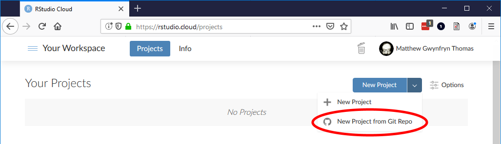
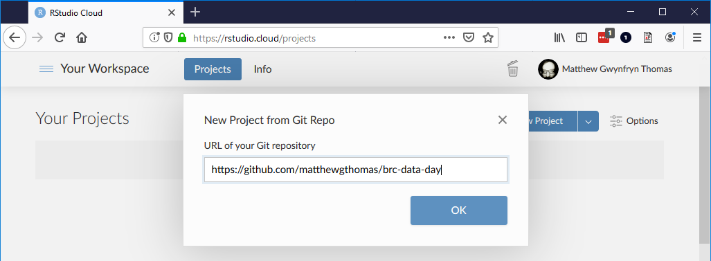

# Data, code and instructions for the R session of British Red Cross's 'data day'

This interactive session will use an online version of R and RStudio -- hosted at https://rstudio.cloud/ -- to save you from needing to install software on your own computers.

## To do before the day
Sign up for an account at https://login.rstudio.cloud/register

## On the day
Log in to your account at https://rstudio.cloud/

Click the down arrow next to the 'New Project' button and then click 'New Project from Git Repo'

In the 'URL of your Git repository' box, type `https://github.com/matthewgthomas/brc-data-day` and click OK.

